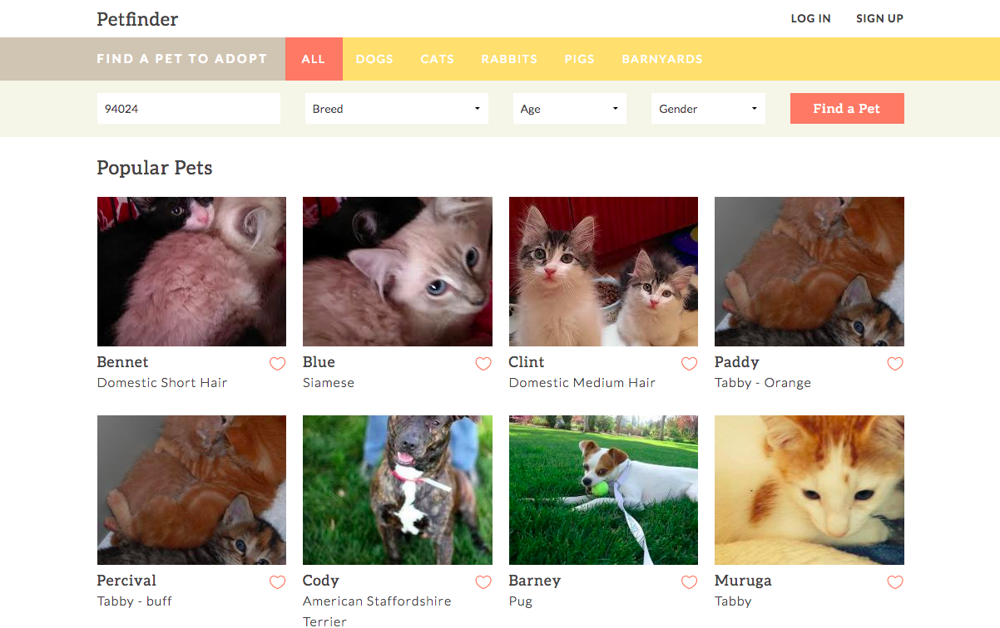

# Petfinder 
> a simple redesign and implementation of the Petfinder website using the MEANstack and Petfinder API, for CS4550 Web Development semester project.

## Setting Up
```javascript
// Install Dependencies
$ npm install

// Start Server
$ node server.js
```

## Live Demo

<br/>
[Live Demo](http://petfinder-app.herokuapp.com/)

## Project Overview
Read more about the project's design and development [here](http://net4.ccs.neu.edu/home/elisef/petfinder/overview.html)
